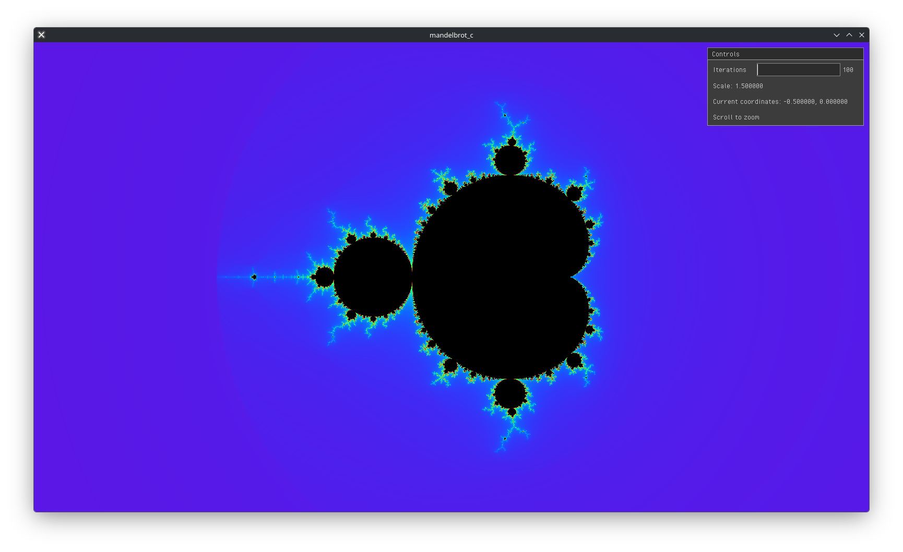
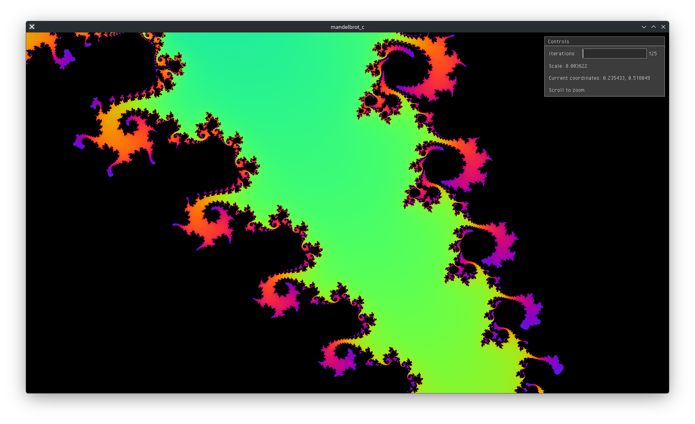
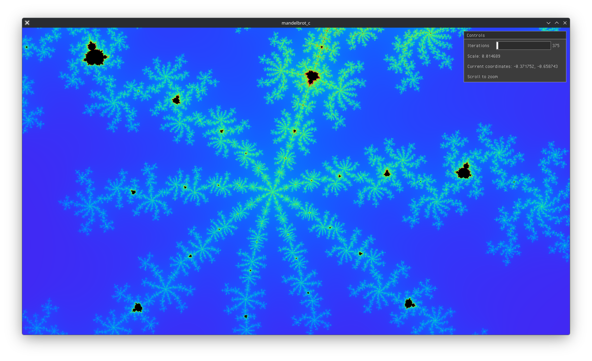
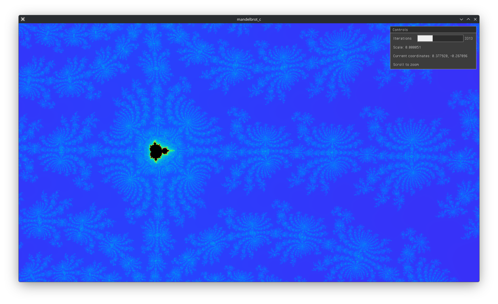

# mandelbrot_c
Interactive Mandelbrot Set visualizer built with raylib and GLSL shaders.






---

## How does this work?

The Mandelbrot set is computed in a fragment shader using the escape-time algorithm.

Each pixel is mapped to a point `c` in the complex plane. Starting from `z = 0`, the shader iteratively evaluates:

    z = z² + c

If `|z|` exceeds 2, the point is considered outside the set.  
The number of iterations before divergence defines the pixel color.

Zoom and pan are implemented by adjusting the complex plane center and scale, which are passed to the shader as uniforms, enabling real-time exploration entirely on the GPU.

## Build & Run

### Requirements

- CMake (>= 4.1)
- Raylib
- A C compiler

### Linux

```bash
git clone https://github.com/joaovvbonatti/mandelbrot_c.git
cd mandelbrot_c
mkdir build
cd build
cmake ..
make
./Mandelbrot
```

## Further Reading


- Wikipedia – Mandelbrot Set  
  https://en.wikipedia.org/wiki/Mandelbrot_set  
  Mathematical background and historical context.

- Raylib Official Website  
  https://www.raylib.com/  
  Documentation, examples, and API reference.

- The Book of Shaders  
  https://thebookofshaders.com/  
  Excellent introduction to GLSL and fragment shaders.
